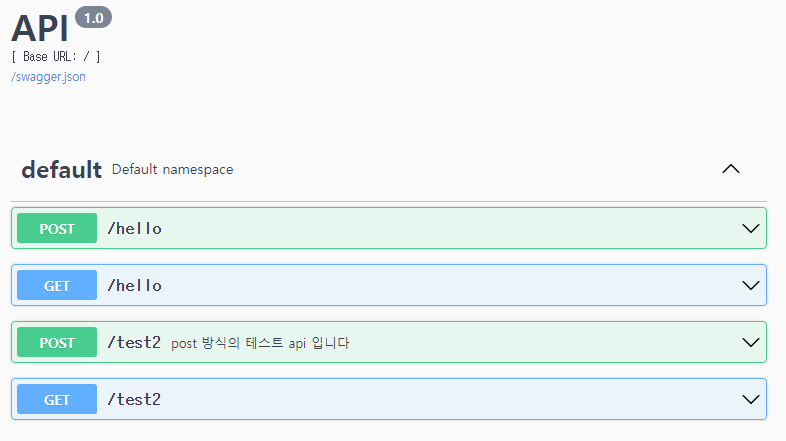

# 개요
Flask + Flask-restx 예제


Flask
* git : https://github.com/pallets/flask
* doc : https://flask.palletsprojects.com/en/2.0.x/


# Flask-restx 란?
Flask-restx
* git : https://github.com/python-restx/flask-restx
* doc : https://flask-restx.readthedocs.io/en/latest/
* API 서비스를 시각적으로 쉽게 볼 수 있게 하는 `Swagger UI`(https://swagger.io/tools/swagger-ui/) 라는 것을 연동시켜서 볼 수 있게 해준다.




# PIP 리스트
(도커 없이 테스트할 때)

```
pip install flask
pip install flask-restx
```


# flask 실행
(도커 없이 테스트할 때)

`flask run -p 5000`


참고) docker 내에서 이용할 때에는 host 를 `0.0.0.0`으로 주어야 한다. (모든 곳에서 이용가능하게 하겠다는 의미로 보임)
이 설정은 Dockerfile 이나 docker-compose 둘 중 한 군데에서 지정하면 된다. (기본값이 localhost 인 것으로 생각되는데, 
이 경우에 도커 컨테이너에서 실행될 때에 접근이 안 되는 듯함)


# 변경 사항이 있을 때
변경사항이 생기면 flask를 재시작하여야 반영이 된다. 

(도커 없이 테스트할 때) 기존에 실행되던 것을 종료하고, `flask run -p 5000`를 다시 한다.

(도커로 할 때)도커 컨테이너를 재시작한다.


# Docker 실행
`docker-compose up --build --force-recreate -d`

프로젝트 경로에서 커맨드 실행 후, 브라우저에서 다음을 접속

http://localhost:16000